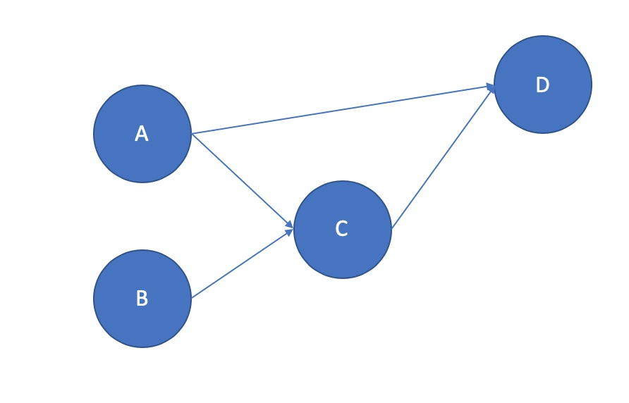
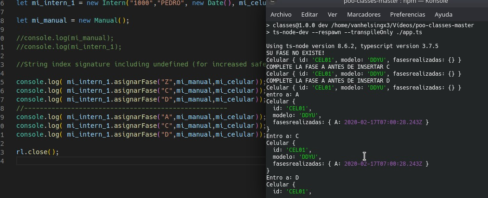

# La tarea 2 

Segun el codigo que hicimos el día jueves, modificar el método assignPhase para que soporte este tipo de dependencias. 

### Nombre de alumno: Gabriel Alexander Barrientos Hernández.
### Sección: 2000 Clase: POO
### Número de cuenta: 2018100058

Archivos módificados para esta tarea:

__Manual.ts, App.ts, Intern.ts__

